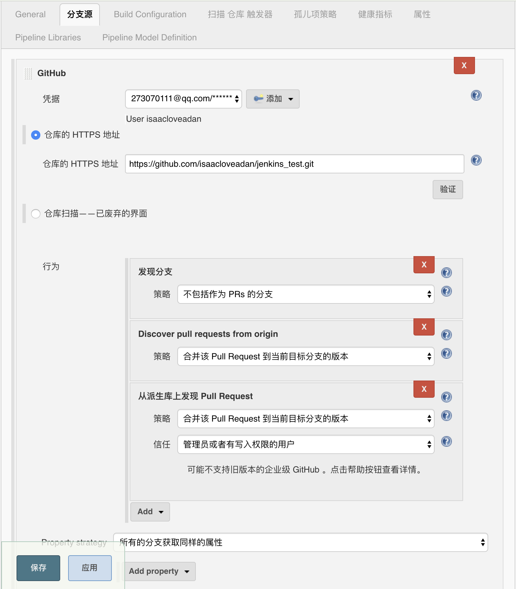

## 在项目根目录创建Jenkinsfile
```Groovy
pipeline {
    agent { docker 'node:6.3' }
    stages {
        stage('build') {
            steps {
                sh 'npm --version'
            }
        }
    }
}
```
## 初步理解为环境为docker的node6.3环境，运行脚本npm --version 打印信息
## 将仓库发布到github后，本地开启jenkins服务，new item,选择Multibranch Pipeline，

## 配置如下，保存后，开始构建，就能看到打印输出，注意本地要开启docker环境